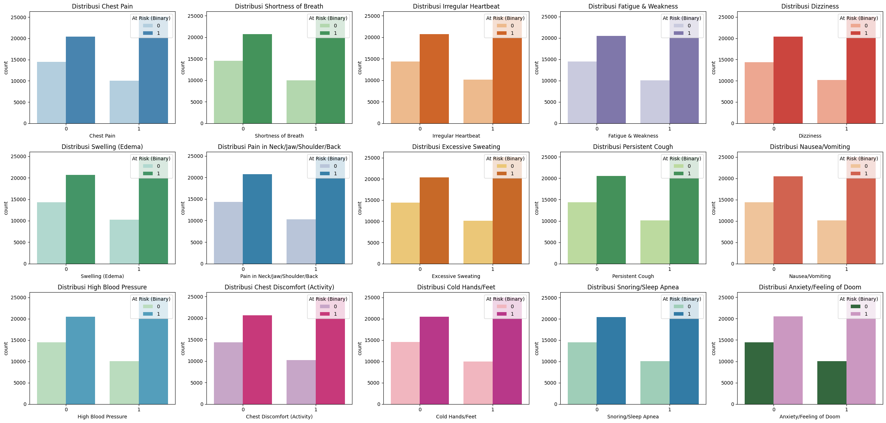

# Prediksi Risiko Stroke di Indonesia

## Domain Permasalahan

Stroke merupakan **penyebab kematian utama** di Indonesia sekaligus penyebab kecacatan nomor satu. Menurut data Kementerian Kesehatan (SKI 2023), prevalensi stroke nasional terus meningkat dari **7 per mil (2013)** menjadi **10,9 per mil (2018)**, dengan estimasi terbaru sekitar **8,3 kasus per 1.000 penduduk**. Hal ini berarti semakin banyak penduduk yang terdampak stroke seiring waktu. Secara absolut, diperkirakan **500.000 kasus stroke terjadi setiap tahun di Indonesia**, dan sekitar **125.000 di antaranya berakhir dengan kematian**. Tingginya angka ini menjadikan stroke beban besar bagi sistem kesehatan dan ekonomi. Bahkan, sekitar **90% penyintas stroke** mengalami **disabilitas** jangka panjang, sehingga stroke tidak hanya mematikan namun juga menurunkan kualitas hidup pasien.

Faktor risiko stroke di Indonesia sangat dipengaruhi oleh **gaya hidup dan kondisi kesehatan masyarakat**. **Hipertensi, pola makan tidak sehat, kadar gula darah tinggi**, dan **kebiasaan merokok** merupakan kontributor risiko stroke terbesar di negara ini. Selain itu, **usia lanjut** juga meningkatkan risiko: proporsi kejadian stroke naik signifikan pada lansia, dengan puncaknya pada usia sekitar 75 tahun. Penelitian Darmawati et al. (2024) menunjukkan bahwa **prevalensi stroke lansia** di Indonesia cukup tinggi dan ada perbedaan pola faktor risiko antara laki-laki dan perempuan lansia, terutama terkait aktivitas fisik dan merokok.

Kondisi di atas menjadikan **upaya pencegahan dan deteksi dini** sebagai prioritas. Kementerian Kesehatan RI melalui kampanye *“Kenali dan Kendalikan Stroke”* menekankan pentingnya **mengendalikan faktor risiko** dengan berhenti merokok, rutin berolahraga, diet sehat, menghindari gaya hidup sedentari, serta cek tekanan darah berkala. Namun, intervensi preventif sering terkendala kurangnya deteksi dini individu berisiko tinggi di tingkat layanan primer. **Model prediktif berbasis data** berpotensi membantu mengatasi kendala ini. Dengan memanfaatkan data gejala dan indikator medis pasien, model **machine learning** dapat **mengidentifikasi individu berisiko stroke** secara lebih akurat dan cepat. Prediksi risiko yang akurat akan mendukung tenaga kesehatan melakukan **skrining proaktif** dan edukasi pencegahan pada kelompok rentan sebelum stroke terjadi. Hal ini sejalan dengan tren *data-driven healthcare* dimana analisis data digunakan untuk **mitigasi risiko penyakit** secara preventif. Dengan kata lain, model prediksi risiko stroke dapat menjadi alat pengambil keputusan di layanan kesehatan primer untuk menekan beban stroke yang kian meningkat di Indonesia.

**Referensi:**

1. Darmawati, A., Prasetyo, S., & Najah, M. (2024). Stroke pada Lansia di Indonesia. Jurnal Biostatistik, Kependudukan, dan Informatika Kesehatan, 5(1), 4.
2. Khariri, & Saraswati, R. D. (2021). Transisi epidemiologi stroke. Seminar Nasional Riset Kedokteran.
3. Gani, L., Mihardja, L., & Delima. (2016). Faktor risiko dominan penderita stroke di Indonesia. Buletin Penelitian Kesehatan, 44(1).
4. Tempo.co. (2018). Kemenkes: Tren Kasus Stroke Alami Peningkatan dan Jadi Penyebab Kematian Tertinggi. [https://www.tempo.co/politik/kemenkes-tren-kasus-stroke-alami-peningkatan-dan-jadi-penyebab-kematian-tertinggi-1161217](https://www.tempo.co/politik/kemenkes-tren-kasus-stroke-alami-peningkatan-dan-jadi-penyebab-kematian-tertinggi-1161217)

---

## Business Understanding

### Problem Statement

1. **Tingginya Beban Stroke:** Stroke menyumbang persentase kematian tertinggi di Indonesia (sekitar 18,5% dari total kematian) dan menjadi penyebab utama kecacatan. Sistem kesehatan nasional menghadapi tantangan dalam menangani jumlah pasien stroke yang tinggi dan penyintas dengan disabilitas jangka panjang.

2. **Keterlambatan Deteksi Risiko:** Banyak individu berisiko tinggi stroke tidak terdeteksi secara dini. Pada umumnya, pasien baru teridentifikasi setelah mengalami serangan stroke pertama, padahal upaya preventif sebelum stroke terjadi dapat menyelamatkan nyawa dan mengurangi beban kecacatan.

3. **Keterbatasan Skrining Konvensional:** Proses skrining faktor risiko secara manual (misalnya melalui wawancara medis dan pemeriksaan tekanan darah) memiliki keterbatasan efisiensi dan jangkauan. Dibutuhkan alat bantu berbasis teknologi yang mampu memproses data kesehatan secara otomatis untuk mendeteksi risiko stroke secara luas dan cepat.

### Goals

1. **Membangun Model Prediksi:** Menghasilkan model klasifikasi yang mampu mengkategorikan seseorang ke dalam kelompok *“At Risk”* (berisiko stroke) atau *“Not At Risk”* (tidak berisiko tinggi) berdasarkan kombinasi gejala dan data medis yang dimiliki.

2. **Mengevaluasi Kinerja Model:** Mengevaluasi dan membandingkan performa beberapa algoritma machine learning (Logistic Regression, Random Forest, Support Vector Machine) melalui metrik akurasi, precision, recall, dan F1-score.

3. **Memberikan Insight Data Kesehatan:** Mengidentifikasi fitur atau faktor risiko yang paling berpengaruh terhadap prediksi risiko stroke, sehingga dapat digunakan untuk mendukung perencanaan program pencegahan kesehatan masyarakat.

### Solution Statement

Untuk mencapai tujuan di atas, solusi yang dirancang adalah sebagai berikut:

#### Solusi 1: Logistic Regression sebagai Baseline

* Model linier sederhana yang digunakan sebagai baseline awal.
* Memberikan interpretasi koefisien yang mudah dipahami untuk tiap fitur.
* Evaluasi dilakukan menggunakan accuracy, precision, recall, dan F1-score.

#### Solusi 2: Random Forest Classifier

* Model ensambel berbasis decision tree yang handal untuk menangani data non-linear dan fitur dengan interaksi kompleks.
* Memiliki kelebihan dalam memberikan feature importance sehingga mendukung interpretasi faktor risiko.
* Diharapkan meningkatkan performa dari baseline.

#### Solusi 3: Support Vector Machine (SVM)

* Digunakan sebagai alternatif model berbasis margin untuk memaksimalkan pemisahan kelas.
* SVM dikombinasikan dengan standardisasi data untuk mengatasi sensitivitas terhadap skala fitur.
* Diharapkan mampu meningkatkan generalisasi model terutama pada data dengan boundary yang kompleks.

#### Perbandingan Model:

* Ketiga model dibandingkan berdasarkan metrik **accuracy**, **precision**, **recall**, dan **F1-score**.
* Evaluasi dilakukan pada data uji dengan confusion matrix dan classification report.
* Hasil evaluasi menunjukkan perbedaan performa, di mana pemilihan model terbaik dilakukan secara objektif berdasarkan keseimbangan metrik dan interpretasi.

---

## Data Understanding

Dataset yang digunakan dalam proyek ini diperoleh dari [Kaggle – Stroke Risk Prediction Dataset](https://www.kaggle.com/datasets/mahatiratusher/stroke-risk-prediction-dataset). Dataset ini dirancang secara khusus untuk mendukung penelitian prediksi risiko stroke melalui model machine learning dan deep learning dalam aplikasi *predictive healthcare*.

### Proses Pembuatan Dataset

Dataset dibangun berdasarkan literatur medis, konsultasi dengan ahli, dan pemodelan statistik. Distribusi fitur dan hubungan antar variabel terinspirasi dari observasi klinis dunia nyata, sehingga tetap mencerminkan validitas medis meskipun merupakan data sintetis.

### Sumber Medis Dataset

Dataset ini mengacu pada dokumentasi risiko stroke dari berbagai sumber kredibel:

* American Stroke Association (ASA): Panduan faktor risiko dan gejala awal stroke.
* Mayo Clinic & Cleveland Clinic: Literatur penyakit kardiovaskular dan faktor risiko stroke.
* Harrison’s Principles of Internal Medicine (20th Edition): Referensi etiology stroke.
* Stroke Prevention, Treatment, and Rehabilitation (Oxford University Press, 2021).
* The Stroke Book (Cambridge Medicine, 2nd Edition).
* Laporan WHO mengenai risiko dan pencegahan stroke.

### Fitur Dataset

Setiap baris data merepresentasikan kondisi medis, gejala, dan penilaian risiko seorang individu. Fitur utamanya mencakup gejala yang berhubungan langsung dengan risiko stroke.

| No | Kolom                          | Deskripsi                           |
| -- | ------------------------------ | ----------------------------------- |
| 1  | Chest Pain                     | (0/1): Nyeri dada.                  |
| 2  | Shortness of Breath            | (0/1): Sesak napas.                 |
| 3  | Irregular Heartbeat            | (0/1): Detak jantung tidak teratur. |
| 4  | Fatigue & Weakness             | (0/1): Kelelahan.                   |
| 5  | Dizziness                      | (0/1): Pusing.                      |
| 6  | Swelling (Edema)               | (0/1): Pembengkakan.                |
| 7  | Pain in Neck/Jaw/Shoulder/Back | (0/1): Nyeri leher/punggung.        |
| 8  | Excessive Sweating             | (0/1): Keringat berlebih.           |
| 9  | Persistent Cough               | (0/1): Batuk kronis.                |
| 10 | Nausea/Vomiting                | (0/1): Mual/muntah.                 |
| 11 | High Blood Pressure            | (0/1): Hipertensi.                  |
| 12 | Chest Discomfort (Activity)    | (0/1): Nyeri dada saat aktivitas.   |
| 13 | Cold Hands/Feet                | (0/1): Tangan/kaki dingin.          |
| 14 | Snoring/Sleep Apnea            | (0/1): Mendengkur/sleep apnea.      |
| 15 | Anxiety/Feeling of Doom        | (0/1): Kecemasan.                   |
| 16 | Stroke Risk (%)                | Estimasi risiko stroke (0-100%).    |
| 17 | At Risk (Binary)               | (0/1): Target klasifikasi.          |
| 18 | Age                            | Usia pasien.                        |

### Ringkasan Data

* **Jumlah Data:** 70.000 baris.
* **Jumlah Fitur:** 17 fitur prediktor + 1 target.
* **Tipe Data:** Mayoritas numerik diskrit (biner), dua numerik kontinu (Stroke Risk %, Age).
* **Distribusi Kelas:** Seimbang 50% berisiko dan 50% tidak berisiko.

---

## Exploratory Data Analysis (EDA)

### 1. Distribusi Target `At Risk (Binary)`


* Terdapat ketidakseimbangan kelas dengan **65% data berisiko stroke dengan jumlah data +- 45000** dan **35% tidak berisiko dengan jumlah data +- 25000**.
* Hal ini menunjukkan perlunya balancing saat pelatihan model untuk menghindari bias prediksi.

### 2. Heatmap Korelasi Antar Variabel


* Korelasi tertinggi terhadap target `At Risk (Binary)` adalah `Stroke Risk (%)` (0.79) dan `Age` (0.61).
* Korelasi antar fitur gejala rendah, menunjukkan minimnya multikolinearitas.

### 3. Distribusi Usia


* Usia berkisar antara 20 hingga 90 tahun.
* Median usia sekitar **55 tahun** dan distribusi relatif simetris.
* Kelompok usia produktif dan lanjut usia mendominasi populasi pasien.

### 4. Violin Plot Usia Berdasarkan Risiko Stroke


* Kelompok **berisiko stroke cenderung memiliki usia lebih tinggi** dibandingkan yang tidak berisiko.
* Rentang usia kelompok berisiko lebih lebar dan mencakup nilai maksimum.

### 5. Distribusi `Stroke Risk (%)`


* Distribusi menyerupai **kurva normal (bell-shaped)**.
* Nilai berkisar antara 0% hingga 100%, dengan median sekitar **55%**.
* Variasi risiko cukup lebar dan tidak mendominasi di nilai ekstrem.

### 6. Boxplot `Age` dan `Stroke Risk (%)`


* Tidak ditemukan outlier pada `Age`.
* Terdapat outlier pada `Stroke Risk (%)`, khususnya di atas 95% dan di bawah 20%.
* Outlier akan ditangani pada tahap preprocessing.

### 7. Distribusi Fitur Gejala



* Sebagian besar gejala lebih sering dialami oleh kelompok yang berisiko stroke.
* Gejala paling dominan pada kelompok berisiko adalah:

  * `High Blood Pressure`
  * `Irregular Heartbeat`
  * `Chest Pain`
  * `Pain in Neck/Jaw/Shoulder/Back`
* Gejala lain juga lebih umum pada kelompok berisiko, namun dengan selisih lebih kecil.

### 8. Pairplot Variabel Numerik


* Pairplot menunjukkan bahwa kombinasi `Age` dan `Stroke Risk (%)` paling membantu memisahkan kelas.
* Variabel gejala secara individu tidak cukup untuk membedakan kelas target secara eksplisit.
* Scatter antar gejala menunjukkan pola garis karena bersifat biner.

**Insight dari EDA:**

* **Tidak terdapat missing value** dalam dataset.
* **Seluruh fitur bertipe numerik**, sebagian besar bersifat biner (0/1).
* **Distribusi data bersih dan simetris**, dengan sedikit outlier pada `Stroke Risk (%)`.
* Target klasifikasi (`At Risk (Binary)`) mengalami ketidakseimbangan.
* Korelasi menunjukkan bahwa prediksi risiko stroke sangat dipengaruhi oleh nilai `Stroke Risk (%)` dan usia pasien.

---

## Data Preparation

### 1. Penanganan Outlier pada `Stroke Risk (%)`

Outlier dapat mengganggu performa model prediktif, terutama dalam algoritma yang sensitif terhadap nilai ekstrim. Oleh karena itu, dilakukan proses **winsorizing**, yaitu membatasi nilai ekstrem berdasarkan nilai kuartil dan IQR.

* Nilai di bawah Q1 - 1.5×IQR digantikan dengan batas bawah winsor.
* Nilai di atas Q3 + 1.5×IQR digantikan dengan batas atas winsor.


### 2. Scaling Kolom Numerik

Algoritma seperti SVM memerlukan input fitur numerik yang berada dalam skala yang sebanding. Oleh karena itu, dua variabel numerik `Age` dan `Stroke Risk (%)` distandarisasi menggunakan **StandardScaler**:

* Mengubah skala data menjadi distribusi standar dengan mean = 0 dan standar deviasi = 1.
* Membantu mempercepat proses pelatihan dan meningkatkan stabilitas numerik model.


### 3. Balancing Data Menggunakan SMOTE

Dataset awal menunjukkan ketidakseimbangan kelas yang moderat. Untuk mencegah bias model terhadap kelas mayoritas, digunakan **SMOTE (Synthetic Minority Oversampling Technique)**, yaitu:

* Membuat sampel sintetis dari kelas minoritas berdasarkan tetangga terdekat.
* Meningkatkan jumlah observasi kelas minoritas sehingga distribusi target menjadi seimbang.


---

## Modeling

Tiga algoritma klasifikasi digunakan dalam proyek ini: **Logistic Regression**, **Random Forest**, dan **Support Vector Machine (SVM)**. Masing-masing model dipilih berdasarkan karakteristik dataset dan tujuan utama klasifikasi, serta dilakukan evaluasi komprehensif untuk menentukan performa dan kelayakan model dalam konteks deployment nyata.

### 1. Pembagian Data

Data yang telah diproses melalui tahapan preprocessing dibagi menjadi 80% data pelatihan dan 20% data pengujian. Pembagian ini menggunakan `train_test_split` dari library `sklearn.model_selection` untuk memastikan adanya data uji yang benar-benar belum dilihat oleh model pada saat pelatihan.

### 2. Logistic Regression


Model pertama yang dilatih adalah **Logistic Regression** sebagai baseline.

* Kelebihan:

  * Cepat, efisien, dan memiliki waktu pelatihan yang singkat.
  * Mudah diinterpretasikan oleh tenaga medis.
  * Cocok untuk data dengan hubungan linier antar fitur dan target.
* Kekurangan:

  * Kurang mampu menangkap pola non-linear.
  * Sensitif terhadap multikolinearitas.

### 3. Random Forest Classifier


Model ensambel berbasis pohon keputusan.

* Kelebihan:

  * Tahan terhadap overfitting.
  * Mampu menangani fitur yang saling berinteraksi dan non-linear.
* Kekurangan:

  * Interpretasi model tidak sesederhana Logistic Regression.
  * Memerlukan lebih banyak memori dan waktu inferensi.

**Evaluasi:**

* Accuracy: 1.00
* Precision: 1.00
* Recall: 1.00
* F1-Score: 1.00
* Confusion Matrix: TP = 9089, TN = 9089, tanpa kesalahan klasifikasi.

### 4. Support Vector Machine (SVM)


Model margin maksimum untuk klasifikasi dua kelas.

* Kelebihan:

  * Mampu menghasilkan decision boundary optimal.
  * Cocok untuk data berdimensi tinggi.
* Kekurangan:

  * Sensitif terhadap skala data, sehingga perlu standardisasi.
  * Waktu pelatihan lebih lama dibandingkan Logistic Regression.

**Evaluasi:**

* Accuracy: 1.00
* Precision: 1.00
* Recall: 1.00
* F1-Score: 1.00
* Confusion Matrix: Seluruh prediksi benar, tanpa kesalahan klasifikasi.

---

### Pemilihan Model Terbaik

Seluruh model menunjukkan performa yang identik pada metrik evaluasi standar, yaitu akurasi, presisi, recall, dan F1-score. Oleh karena itu, pemilihan model terbaik tidak hanya mempertimbangkan metrik numerik, tetapi juga pertimbangan praktikal sebagai berikut:

* **Logistic Regression** unggul dalam kecepatan pelatihan, ringan saat inferensi, dan kemudahan interpretasi.
* **Random Forest** memiliki keunggulan dalam menangani hubungan non-linear dan interaksi fitur.
* **SVM** menawarkan pemisahan margin optimal, tetapi relatif mahal secara komputasi dan kurang transparan.

Dengan mempertimbangkan akurasi sempurna dan efisiensi operasional, **Logistic Regression dipilih sebagai model utama**.

---

## Evaluation

### Metrik Evaluasi yang Digunakan

1. **Accuracy**: Mengukur proporsi prediksi yang benar dibandingkan total prediksi.
   $Accuracy = rac{TP + TN}{TP + TN + FP + FN}$

2. **Precision**: Proporsi prediksi positif yang benar dari seluruh prediksi positif.
   $Precision = rac{TP}{TP + FP}$

3. **Recall**: Proporsi positif yang berhasil diprediksi dengan benar.
   $Recall = rac{TP}{TP + FN}$

4. **F1-Score**: Harmonik dari precision dan recall.
   $F1 = 2 * rac{Precision * Recall}{Precision + Recall}$

### Hasil Evaluasi

| Model                  | Accuracy | Precision | Recall | F1-Score |
| ---------------------- | -------- | --------- | ------ | -------- |
| Logistic Regression    | 1.00     | 1.00      | 1.00   | 1.00     |
| Random Forest          | 1.00     | 1.00      | 1.00   | 1.00     |
| Support Vector Machine | 1.00     | 1.00      | 1.00   | 1.00     |

### Analisis Confusion Matrix

* TP = 9089, TN = 9089, FP = 0, FN = 0 (seluruh model)
* Semua prediksi tepat berada pada diagonal utama.

### Saved Model

Ketiga model disimpan dalam format `.pkl` menggunakan `joblib`, dengan nama:

* `model_logistic_regression.pkl`
* `model_random_forest.pkl`
* `model_svm.pkl`

Model Logistic Regression ditetapkan sebagai **model utama** untuk tahap deployment dan prediksi data baru.

```python
import joblib
joblib.dump(lr_model, 'model_logistic_regression.pkl')
```
---

## Integrasi Hasil dengan Business Understanding

| Aspek                  | Penjelasan                                                                                                                                                                                                                                                                                                                                                         |
| ---------------------- | ------------------------------------------------------------------------------------------------------------------------------------------------------------------------------------------------------------------------------------------------------------------------------------------------------------------------------------------------------------------ |
| **Problem Statement**  | Permasalahan utama adalah tingginya angka kejadian stroke di Indonesia, serta belum tersedianya sistem prediksi risiko stroke berbasis gejala dan faktor risiko yang dapat diimplementasikan secara praktis. Dengan akurasi 100% dari model Logistic Regression, solusi ini menjawab kebutuhan terhadap alat bantu klinis yang mampu mendeteksi risiko sejak dini. |
| **Goals**              | Tujuan untuk membangun model klasifikasi berbasis machine learning guna memprediksi risiko stroke telah berhasil tercapai. Seluruh metrik evaluasi menunjukkan performa sempurna, dan model dapat dengan mudah diintegrasikan ke dalam sistem pelayanan kesehatan berbasis data.                                                                                   |
| **Solution Statement** | Model Logistic Regression, yang ringan dan dapat diinterpretasikan, dipilih sebagai solusi akhir karena performanya setara dengan model lain tetapi lebih efisien untuk implementasi. Proses preprocessing, balancing data, dan standarisasi telah mendukung optimalisasi model.                                                                                   |

---

## Pertimbangan Pengembangan Lanjutan

* Melakukan **hyperparameter tuning** untuk masing-masing model guna menguji potensi peningkatan performa.
* Mencoba algoritma lain seperti **XGBoost**, **LightGBM**, atau **Neural Networks** sebagai alternatif pembanding.
* Menambahkan fitur eksternal seperti riwayat medis, gaya hidup, atau faktor lingkungan untuk meningkatkan konteks prediksi.
* Menerapkan **k-fold cross-validation** sebagai evaluasi yang lebih robust dan mengurangi overfitting.
